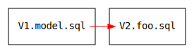
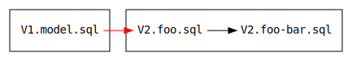
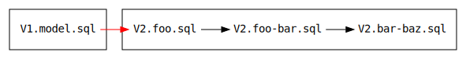
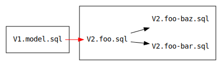
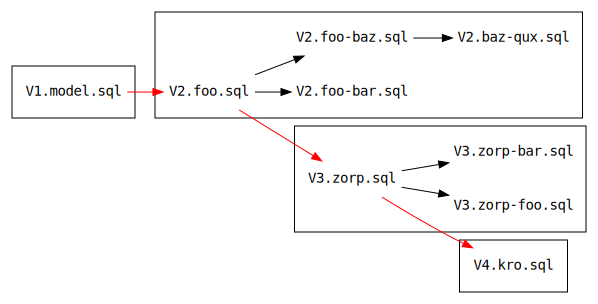


# Migration trees

If you're working alone on a project, it usually makes sense to have a linear migration sequence. So next time you need
a migration, you'll write `V3.nextfeature.sql`, then `V4.etc.sql`, and so on.

However, if you're working on a team, strictly ordered migrations can be a real pain. Say for example you're working on
a feature where articles are tagged in categories like `f#` or `tutorial`, so you create `V3.tags.sql`.
But at the same time, some guy named Robert is trying to add a feature that lets users add articles to their favorites.
He doesn't know about your migration, so he names his `V3.favorites.sql`.

When you merge, you have two different V3 migrations. This is a problem! Now you'll need to get together and decide
which one should be V3 and which should be V4, and one of you will have to manually fix up the migration history on
your development database instance.

To avoid this situation, you can take advantage of the fact that most migrations just add things to the schema,
they don't remove things. This means they can run in any order, as long as their dependencies are satisfied.

Rezoom.SQL can identify these "non-destructive" migrations, and will allow you to define them as add-ons to the current
major version number instead of bumping to the next major version.

This feature is called "migration trees".

# Adding a non-destructive migration

Within each version number (V1, V2, V3, etc.), migrations are named. The first
migration you write with a given major version has a filename like:

`V<major version>.<migration name>.sql`

So let's say you have these migrations so far:

* `V1.model.sql`
* `V2.foo.sql`



To add a non-destructive migration called `bar` that depends on `foo`, simply
name it like so to create a **sub-migration**:

`V2.foo-bar.sql`



If you then have another non-destructive migration called `baz` that depends on
`bar`, you can name it:

`V2.bar-baz.sql`



But if it doesn't really need the stuff added in `bar`, and would work fine with
the stuff defined in `foo`, you should name it:

`V2.foo-baz.sql`



Each major version number has its own migration tree, which, while it's
frequently just a single root node, can have arbitrarily many child migrations,
as in the below example:



At compile time, the following facts are validated about each migration tree:

* Running each migration in depth-first order does not result in any conflicts
  (e.g. multiple migrations creating tables of the same name).

* Migration names are unique within each major version (can't have both
  `foo-baz` and `bar-baz`).

* No migrations other than the root of a tree (red arrows) contain "destructive"
  statements.

Destructive statements include:

* `DROP TABLE`
* `ALTER TABLE x RENAME TO y`
* `UPDATE`
* `DELETE`

Non-destructive statements include:

* `CREATE TABLE`
* `CREATE VIEW`
* `ALTER TABLE x ADD COLUMN y`

# Realistic guidelines

If you're working in a team with other developers, here's the plan:

* Get together and agree on changes when you need to bump the major version.
  This may be because you need to run destructive migrations, or because you
  have a migration that depends on multiple previous migrations spanning
  separate branches of the current version's migration tree.

* When working on features that can be satisfied with constructive migrations,
  name your sub-migrations well so as to avoid collisions with teammate's
  migration names. Try to have the "parent" of each migration be as high as
  possible in the tree, i.e. depend on as few other migrations as possible.

# Retroactive migrations

When you run migrations, you can pass a `MigrationConfig` object:

```fsharp
open Rezoom.SQL.Migrations
open Rezoom.SQL

type ExampleModel = SQLModel<".">

[<EntryPoint>]
let main argv =
    ExampleModel.Migrate(MigrationConfig.Default)
```

In development, you may want to specify `AllowRetroactiveMigrations = true`:

```fsharp
let main argv =
    ExampleModel.Migrate({ MigrationConfig.Default with AllowRetroactiveMigrations = true })
```

This allows you to run sub-migrations from older version numbers. Normally the
`Migrate` method bails out when the database has been migrated to a newer
version, but an older version still has some sub-migrations that have not yet
been run. In development, occasionally you *know* it'll be fine and just want to
get your database up-to-speed.
