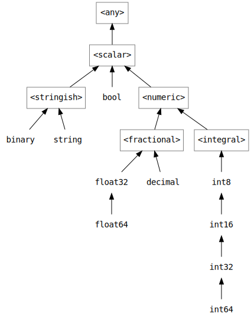

# Data Types

Currently RZSQL supports the following data types. These are the types you can
use for columns in `CREATE TABLE` statements, in `CAST` expressions, and the
like.

| RZSQL type     | .NET type             | SQLite type | TSQL type       |
|----------------|-----------------------|-------------|-----------------|
| string(n)      | System.String         | varchar     | nvarchar(n)     |
| string         | System.String         | varchar     | nvarchar(max)   |
| binary(n)      | System.Byte[]         | blob        | varbinary(n)    |
| binary         | System.Byte[]         | blob        | varbinary(max)  |
| guid           | System.Guid           | blob        | uniqueidentifier|
| bool           | System.Boolean        | integer     | bit             |
| int, int32     | System.Int32          | integer     | int             |
| int16          | System.Int16          | integer     | smallint        |
| int64          | System.Int64          | integer     | bigint          |
| float32        | System.Single         | float       | float(24)       |
| float, float64 | System.Double         | float       | float(53)       |
| decimal        | System.Decimal        | N/A         | numeric(38, 19) |
| datetime       | System.DateTime       | N/A         | datetime2       |
| datetimeoffset | System.DateTimeOffset | N/A         | datetimeoffset  |

The syntax to use when a type name is expected is obvious enough from the first
column in the above table, but is also documented in the following railroad
diagram:

### _type-name_



# How types are inferred

RZSQL types are organized in a hierarchy in order to permit things like adding
an `int64` to an `int32`. When the typechecker encounters an expression such as
`a > b`, the types of `a` and `b` are "unified". This results in an error unless
`a` and `b` have the same types or one is an ancestor of the other's type.

A type variable such as `@x` may be unified with types in many places. The most
specific type always wins, so in the expression `@x >= someInt32 and @x <
someInt16`, @x is inferred to have type `int32`, because it is lower in the type
hierarchy than `int16`.

Here is the current type hierarchy. Notice that there are some types in the
hierarchy that do not appear in the above table. These exist just as constraints
so that we can model functions like TSQL's `datalength`, which works on both
`binary` and `string` types. It is not possible to reference them in your own
RZSQL code, such as in `CAST` expressions.



# How nullability is inferred

RZSQL makes an effort to infer whether or not an expression's result can be
null. This is important since it generates types to represent the result sets of
SQL expressions, and must use an `option<'a>` instead of an `'a` if a null might
show up in the corresponding column.

Most expressions (like `a * b`) are assumed to be potentially null if _either_
of their inputs are potentially null. When an expression uses a function, the
nullability depends on the function. For example, in TSQL, the `power(base,
power)` function has "infectious" arguments in that if either of them is
nullable, the output is inferred to be nullable. However, the `coalesce`
function's output is only nullable if its last argument is nullable.

When a query is parameterized, RZSQL must also figure out which parameters
should be nullable. To this end, it assumes some expressions must be nullable.

In particular, expressions on both sides of the `IS` and `IS NOT` operators are
assumed to be nullable, because there is no point in using those operators over
`=` and `<>` other than for their behavior in the presence of nulls.

This means that if you write a query like this, `@name` will be inferred
non-nullable:

```sql
select * from Users where Name = @name
```

But if you use the `IS` operator instead, like so, `@name` is inferred to be
nullable, so you'll have to pass `None` or `Some "name"` to the query.

```sql
select * from Users where Name is @name
```

Some function arguments are also assumed to be nullable. All arguments but the
last to the `coalesce` function are assumed nullable. This also applies to some
backend-specific functions, like the SQLite `ifnull` function.

Finally, any expression inserted into a nullable table column is assumed to be
nullable.

# Nullability inference on left joins

All columns in a table on the right side of a `left join` are nullable. This is
because when the join does not match any rows in the right-hand table, the
result set will contain a row of all NULLs.

However, this is a special kind of nullability which you can ignore when
consuming a result set in your program by using [navigation
properties](NavigationProperties.md).

# Nullability inference on more complex expressions

What follows is intended to satisfy curious readers -- most queries do not
exercise this corner of the typechecker.

When an expression is assumed to be nullable, for example, because it appears on
either side of an `IS` operator, the effect varies depending on how that
constraint could be satisfied.

In the simplest case, as seen above, the expression is a parameter, like
`@name`, so the typechecker simply concludes that the parameter must be
nullable.

This also works for somewhat more complex expressions. For example, it could be
a binary operation like `@count + 1`, or even a scalar sub-query, like `(select
@name as n)`. In both these cases. the typechecker concludes that the whole
subquery's result is nullable if-and-only-if the parameter in question is
nullable, so again, it makes the parameter's type nullable to satisfy the
constraint.

What about expressions involving multiple parameters? Consider [this
query](http://rzsql.net/#011CADD14BA2DBA4E91B39CCE86D48EDF2726A7C):

```sql
select 1 as col where 1 is @x + @y
```

In SQL, the expression `@x + @y` is nullable if-and-only-if `@x` **OR** `@y` is
nullable. This is precisely how the typechecker models the nullability of the
expression. Forcing it to be nullable could be satisfied by making _either_
parameter nullable, but in the absence of other information, the typechecker
will assume _both_ `@x` and `@y` are nullable.

However, because you may not always want both parameters to be nullable,
nullability inference occurs in two stages:

1. Expressions assumed nullable whose nullability is based on a single parameter are processed.
2. Remaining expressions are processed.

You can use the `nullable` function to tell the type checker that one of the two
parameters is nullable. It will pick this up in the first pass. Then, in the
second pass, it will know that it does not need to make the other parameter
nullable.

See [this example](http://rzsql.net/#CDF2BE7EA720284F2640B4BEA1AAFDEA9CCD8EC2):

```sql
select 1 as col where 1 is @x + nullable(@y)
```

Notice that this is an [erased function](Functions/README.md#erased-functions),
so using it has no effect on the compiled SQL code.


