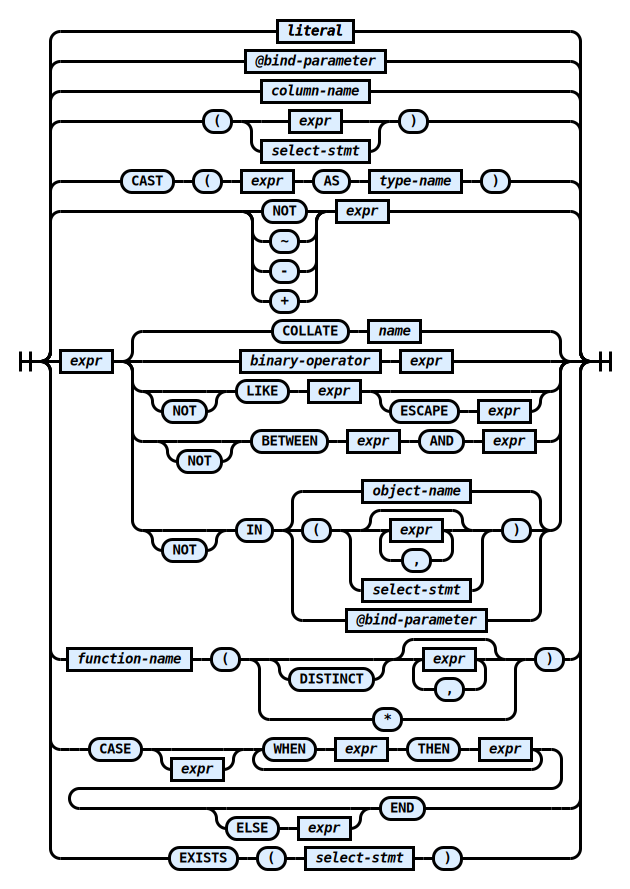

# Expressions

Expressions are the most complex part of RZSQL's syntax. An expression
represents a computation that produces a **scalar value**, that is, a value of
some [data type](DataTypes.md) that could be stored in a table column.

The full syntax diagram for `expr` is rather daunting, but may serve as a useful
reference.

### _expr_

## The simplest expressions

Sprinkled onto the spaghetti of the above diagram are some tasty meatballs of
simplicity. These are the best starting points for getting a handle on
expressions, so they're right at the top.

#### Literals

A [literal](Literal.md) is just a plain value like `1` or `'Jeff'`.

### Bind parameters

TODO