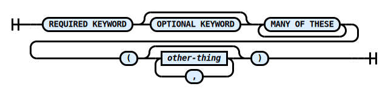
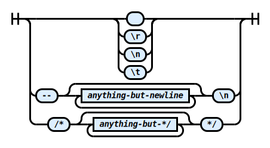

# Language

This section covers RZSQL, the SQL dialect implemented by Rezoom.SQL.

In a perfect world, this would not be necessary. After all, there is an ANSI
standard for SQL, which is even updated on a regular basis. However, with no
disrespect meant to the standard authors (who are not at fault), this is a joke,
because the SQL dialects are used in reality have only a vague resemblance to
the standard and to each other.

For this reason, Rezoom.SQL implements its own SQL dialect, which it can
translate to the appropriate syntax for different backends.

RZSQL is based very closely on [SQLite's flavor of
SQL](https://www.sqlite.org/lang.html). In fact, it was implemented by starting
with a complete SQLite parser, removing features that don't make sense on other
backends, and adding a couple extensions. I mention this fact because it means
that if you can't figure out how to do something from this documentation, you
can try looking it up for SQLite. There's a good chance the syntax is the same.

## The basics

RZSQL source code is case-insensitive. You can write `SELECT` or `select` or
even `SeLeCt` and the result is the same. This is true not only for keywords but
for table and column names. However, string comparisons, such as in the
expression `'abc' == 'ABC'` may or may not be case-sensitive depending on your
collation settings. RZSQL does not play a role in that scenario, it is between
you and your database backend.

Most elements of syntax are separated by whitespace, meaning one or more space,
newline, or tab characters. To avoid clutter, whitespace is not mentioned in the
syntax diagrams in this documentation. You are expected to infer that whitespace
should appear between `SELECT` and `DISTINCT` but not, say, between the digits
of a number.

Anywhere whitespace is permitted, comments are also permitted. Comments come in
two forms. A line comment begins with `--` and causes all following text until
the end of the line to be ignored. A block comment begins with `/*` and causes
all following text until the closing `*/` to be ignored.

Note that block comments cannot be nested. That is, no matter how many `/*`s you
use, the first `*/` will terminate the comment.

## Railroad diagrams

Through the language section of this documentation, you will encounter
**railroad diagrams**, like the one below. A railroad diagram shows you the
syntax for an element of the language. Follow the line starting from the left,
and remember that any time you come to a fork in the "track", you can take
either path and still have valid syntax.

### _railroad-demo_

Rectangular nodes in a railroad diagram refer to other elements of the syntax.
Often these are clickable links to other railroad diagrams, but sometimes they
are just self-explanatory descriptions of what's expected, like `decimal-digit`.

Here's a real railroad diagram for whitespace and comments.

### _whitespace-or-comment_

I used [a python library](https://github.com/tabatkins/railroad-diagrams) by
[tabatkins](https://github.com/tabatkins) to generate the railroad diagrams in
this documentation.