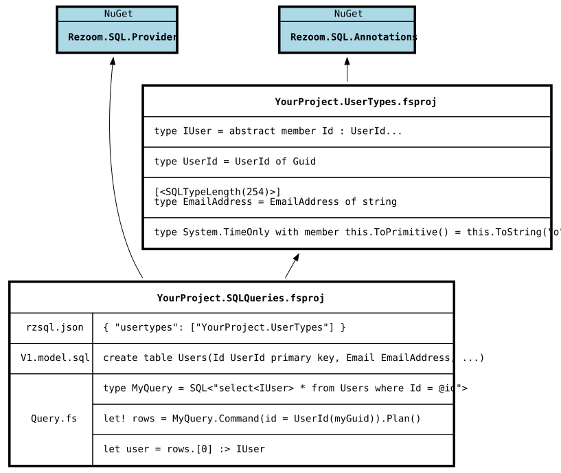

<!-- nav-top -->
[Home](../../README.md) &gt; UserTypes

[&larr; Language Omissions](../Language/MissingFeatures.md) | [Field lengths and storage type &rarr;](FieldLengthsAndStorage.md)
<!-- /nav-top -->

# UserTypes

The UserTypes feature allows you to bring custom .NET data types into RZSQL by pointing the type provider at your own assemblies.

This allows you to:

1. Model your domain better, getting columns typed as `EmailAddress` instead of `string`, `UserId` instead of `Guid`, and so on.
2. Make query result row types implement your interfaces. All your queries against the `User` table can return rows implementing an `IUser` interface you define, so you can write consumer code that works on all of them.
3. Remap built-in types to other storage formats. For example, RZSQL's default handling for DateTime in SQLite is to store an ISO8601 string. If you prefer to store it as an integer Unix time, you can do that with a UserType mapping.
4. Store and retrieve data from backend-specific column types RZSQL doesn't natively support, like Postgres `point` or TSQL `geography`.

## The layout

This is how an example solution with UserTypes is arranged:



Your UserTypes MUST be in a separate assembly from your SQL queries, and must build first.

The type provider cannot "see" types defined in the same assembly it's trying to compile. They don't exist yet!

The fsproj where you're using Rezoom.SQL.Provider must have a project reference to your UserType project(s). It must
**also** name those projects in [rzsql.json's](../Configuration/Json.md) `"usertypes"` list. This tells the type
provider to search the listed assemblies at design-time to find your custom types.

Referencing Rezoom.SQL.Annotations is optional. This is a lightweight package that only defines attributes.
Those attributes give you more control over how your custom-mapped UserTypes are translated to SQL.

## Mapping your own primitive types

It's a good practice to model your domain tightly with types. This helps make code self-documenting and allows the
compiler to catch errors where function arguments are passed out-of-order. For example, if you have a function in your domain:

```fsharp
let addUserToGroup (userId : int) (groupId : int) =
    // do stuff
```

It's very easy to accidentally call `addUserToGroup group.Id user.Id` and miss the mistake.

If you have wrapper types and your function signature changes to:

```fsharp
let addUserToGroup (userId : UserId) (groupId : GroupId) =
    // do stuff
```

Then you can't make that mixup without the compiler catching it.

However, implementing a domain model with those wrapper types on top of vanilla RZSQL would be frustrating. You'd
constantly have to convert the raw primitive `int` or `string` or `Guid` values that come out of your SQL query results
to your domain types, and unpack your domain types back to primitives to pass them in as query parameters.

With UserTypes you can solve this. A user-mapped primitive type can take either of the following forms:

### Single-case union

This is the simplest case. Any F# union type with a single case that wraps an underlying [built-in
primitive](../Language/DataTypes.md) will automatically be detected as a valid UserType without needing further annotations or
methods.

```fsharp
// typical single-case DU wrapper pattern
type UserId = UserId of System.Guid

// struct DUs work fine too
[<Struct>]
type FileHash = FileHash of byte[]
```

### ToPrimitive/FromPrimitive static wrappers

This is a more advanced case. Perhaps your type is a little more complicated than a single-case DU wrapper. That's fine,
you can define the mapping directly.

```fsharp
type EmailAddress(rawEmail : string) =
    do
        if isNull rawEmail || not(rawEmail.Contains("@")) then
            invalidArg (nameof rawEmail) "Email must be non-null and contain @"

    override this.ToString() = rawEmail

    static member ToPrimitive(email : EmailAddress) : string = email.ToString()
    static member FromPrimitive(raw : string) : EmailAddress = EmailAddress(raw)
```

`EmailAddress` will be detected as a valid UserType because of the ToPrimitive and FromPrimitive methods mapping it to
string.

If you don't like having those static methods littering your domain, or you can't add them because the type you're
trying to map is from another library you can't edit, that's not a problem!

ToPrimitive and FromPrimitive **do not have to be** declared by the same type that they are mapping.

For example, you can map the BCL type `System.DateOnly` by declaring a static class:

```fsharp
type DateOnlyMapping() =
    static member ToPrimitive(date : DateOnly) : string = date.ToString("o")
    static member FromPrimitive(str : string) : DateOnly = DateOnly.ParseExact(str, "o")
```

Or even a module:

```fsharp
module DateOnlyMapping =
    let ToPrimitive (date : DateOnly) = date.ToString("o")
    let FromPrimitive (str : string) = DateOnly.ParseExact(str, "o")
```

Or my personal preference, F# extension methods:

```fsharp
module MyCustomMappings =
    type DateOnly with
        member this.ToPrimitive() = this.ToString("o")
        static member FromPrimitive(str : string) = DateOnly.ParseExact(str, "o")
```

You can have as many classes as you want defining static custom mappings. But you can't split the mapping for a
*single UserType* across multiple classes. `ToPrimitive : Foo -> string` has to be defined in the *same* class as
`FromPrimitive : string -> Foo` for the mapping to be valid.

## Using the mapped types

Once you've got your UserTypes assembly plugged in via [rzsql.json](../Configuration/Json.md), you can use your
domain types in your database model. Instead of writing `create table Users(Id guid primary key)`, write `create table Users(Id UserId primary key)`.

**Note that while built-in types in RZSQL are case-insensitive, when you reference a UserType you *must* match its .NET type name exactly, case-sensitively!**

When you `select` from that table, you'll get the `Id` column back out in your F# code as a `UserId`, not just a plain `System.Guid`.

And when your query uses a parameter that you compare with the `Id` column, that parameter will be inferred as a `UserId` as well.

```fsharp
type MyQuery = SQL<"select * from Users where Id = @id">

let someGuid = Guid.Parse("6f626f4e-7964-6957-6c6c-526561644974")

plan {
    // command requires a UserId parameter
    let! row = MyQuery.Command(id = UserId someGuid).ExactlyOne()
    let id = row.Id // type is UserId
    let email = row.Email // type is EmailAddress
    return id, email
}
```

## Row interfaces

Another problem the UserTypes features solves is that RZSQL generates a new row type for *every* SQL query you write.

```fsharp
type QueryUserById = SQL<"select * from Users where Id = @id">
type QueryUserByEmail = SQL<"select * from Users where Email = @email">
```

The above two queries both select all columns from the `Users` table, but they have two different row types,
`QueryUserById.Row` and `QueryUserByEmail.Row`.

Those types are *structurally identical* but they are *nominally different*, so you can't easily write code that works on both.

Unfortunately, there is no good way for the provider to make these return the same row type. Each `SQL<...>` invocation
can only generate types *nested under* itself.

However, with UserTypes we can do the next best thing. We can make the generated types implement *the same interface*.

In your UserTypes assembly, write an interface matching the shape of the columns in the query:

```fsharp
type IUserRow =
    abstract member Id : UserId
    abstract member Email : EmailAddress
    // ... etc
```

Now in your queries, you can specify that you want the resulting row type to implement your `IUserRow` interface.
This is done by changing the `select` to `select<IUserRow>`.

```fsharp
type QueryUserById = SQL<"select<IUserRow> * from Users where Id = @id">
type QueryUserByEmail = SQL<"select<IUserRow> * from Users where Email = @email">
```

As long as the columns specified in the `IUserRow` interface are found in the result set, both `QueryUserById.Row` and
`QueryUserByEmail.Row` will implement `IUserRow`.

Now you can write downstream code to consume that interface, such as mapping `IUserRow` to a DTO type that your web API
returns to clients. You no longer have to deal with duplicating boilerplate mapping code on a bunch of different
basically-identical row types.

If the columns needed to implement the interface are *not* present, you'll get an error **at compile-time**.

You can also declare a query implements *multiple* interfaces by separating with commas:

```sql
select<IUserRow, ISoftDelete, IHasThumbnail, IHaveALotOfInterfaces> * from Users
```

---
<!-- nav-bottom -->
[&larr; Language Omissions](../Language/MissingFeatures.md) | [Field lengths and storage type &rarr;](FieldLengthsAndStorage.md)
<!-- /nav-bottom -->

